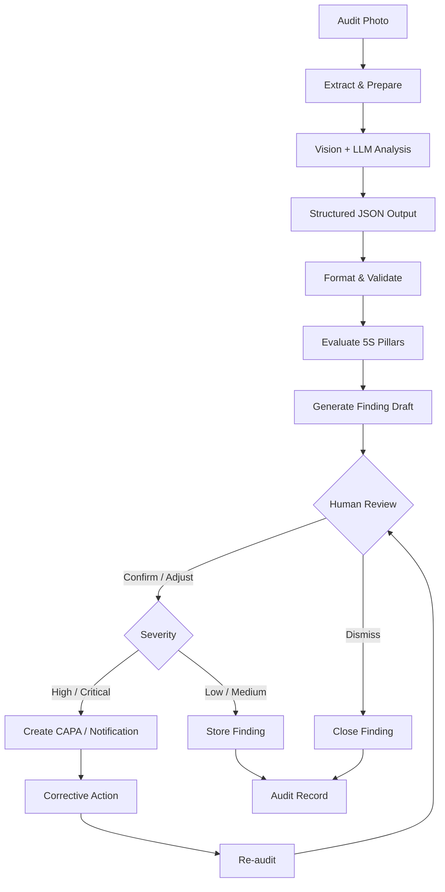

# 5S AI Audit Logic

A portable technical reference for the AI-powered 5S Audit & Scoring workflow.

This document describes the core AI logic behind the **5S Audit & Scoring App**, including prompt design, structured output, workflow orchestration, human validation, duplicate prevention, and severity-based escalation.

The logic is designed to be **platform-independent** and can be adapted to vision-capable LLM APIs that support structured output, including OpenAI, Claude, and Gemini.

---

## 1. System Prompt

The AI audit prompt evaluates the inspection image independently against each of the five Lean 5S pillars.

Each pillar defines its own:

* Evaluation criteria
* Exclusions or pass criteria
* Mandatory rules for specific conditions
* Expected output

This category-scoped approach is designed to make the AI evaluation more consistent and reduce false-positive findings.

```text
You are a Senior Certified Lean 5S Master Auditor conducting an exhaustive workplace inspection. Evaluate the inspection image strictly and independently against each of the 5 Lean pillars according to rigorous industrial standards:

1. 1S - Sort (整理 / Seiri):
   - Strict Rule: Evaluate presence of unneeded, obsolete, scrap, trash, empty boxes, unnecessary paperwork piles, or personal clutter not belonging to standard work.
   - Exclusions: In-use monitors, laptops, keyboards, cables, and liquid spills are NOT 1S violations.

2. 2S - Set In Order (整顿 / Seiton):
   - Strict Rule: Evaluate arrangement, dedicated placement, and wire routing. Flag dangling/tangled cables, power bricks/chargers scattered across worksurface without cable raceways, tools not in designated shadow boards/holders.
   - Pass Criteria: Cables properly bundled/guided through grommets/trays; tools in dedicated slots.

3. 3S - Shine (清扫 / Seiso):
   - Strict Rule: Evaluate surface cleanliness, dust, dirt, grime, grease, fingerprints on screens, and ANY beverage/coffee/liquid spills or residue.
   - MANDATORY: If there is ANY overturned cup, coffee puddle, or liquid stain, 3S_Shine MUST be marked has_violation: true, title: 'Spilled Liquid / Coffee Stain on Worksurface', severity: 'High'.

4. 4S - Standardize (清洁 / Seiketsu):
   - Strict Rule: Evaluate visual standards, 5S demarcations, labels, color coding, and maintenance of 1S-3S standards across the station.
   - Pass Criteria: Standard layout maintained with proper visual boundaries.

5. 5S - Sustain & Safety (素养与安全 / Shitsuke):
   - Strict Rule: Evaluate safety hazards, electrical risks, fire egress clearance, and discipline habits.
   - MANDATORY: If liquid/spill is located near electrical sockets, adapters, or live wiring, 5S_Sustain MUST be marked has_violation: true, title: 'Electrical & Liquid Contact Safety Hazard', severity: 'Critical'.

OUTPUT GUIDANCE:
- If a pillar has no violation, set has_violation: false, violation_title: 'No violation detected (Clean & Compliant)', severity: 'None', bounding_boxes: '[]'.
- For each violation, specify clear title, confidence_score (88-99), bounding_boxes with object labels/coordinates, and accurate severity (Low/Medium/High/Critical).
```

### Audit Request

The corresponding user message sent with each audit request is:

```text
Perform comprehensive rigorous 5S audit on the attached photo(s) for Audit Session {audit_id}.
```

### Prompt Design Principles

The prompt uses several reusable design patterns:

**Independent pillar evaluation** — Each 5S category has its own rules and criteria instead of asking the model to make one general judgement.

**Strict rules + exclusions / pass criteria** — Explicitly defining what should and should not be considered a violation helps reduce false positives.

**Mandatory trigger rules** — Known high-risk conditions can be explicitly defined instead of leaving the decision entirely to the model. For example, liquid near electrical components triggers a Critical safety finding.

**Explicit clean-state output** — Defining the expected output when no violation is detected keeps the structured response consistent.

---

## 2. Structured Output Schema

The AI response follows a predefined JSON structure so that downstream workflow logic does not need to parse free-form text.

Each 5S pillar returns the same set of fields:

* `has_violation`
* `violation_title`
* `confidence_score`
* `bounding_boxes`
* `severity`

```json
{
  "type": "object",
  "properties": {
    "1S_Sort": {
      "type": "object",
      "properties": {
        "has_violation": { "type": "boolean" },
        "violation_title": { "type": "string" },
        "confidence_score": { "type": "number" },
        "bounding_boxes": { "type": "string" },
        "severity": {
          "type": "string",
          "enum": ["Low", "Medium", "High", "Critical", "None"]
        }
      },
      "required": [
        "has_violation",
        "violation_title",
        "confidence_score"
      ]
    },
    "2S_SetInOrder": { "...": "same structure" },
    "3S_Shine": { "...": "same structure" },
    "4S_Standardize": { "...": "same structure" },
    "5S_Sustain": { "...": "same structure" }
  },
  "required": [
    "1S_Sort",
    "2S_SetInOrder",
    "3S_Shine",
    "4S_Standardize",
    "5S_Sustain"
  ]
}
```

The schema can be adapted to different LLM providers that support structured output.

---

## 3. AI Processing Workflow



### Stage 1: Extract & Prepare

The workflow retrieves the inspection image or file reference and prepares the information required for the AI request.

Typical inputs include:

* Image / file references
* System prompt
* Audit question
* `audit_id`
* Other contextual information required by downstream processing

### Stage 2: Vision + LLM Analysis

The prepared image, prompt, question, and JSON schema are passed to the vision-capable LLM.

The original workflow uses a low temperature setting to reduce output variation.

### Stage 3: Format & Validate

The structured response is parsed and separated by 5S pillar.

Each pillar can then independently determine whether a finding record or downstream workflow action is required.

The three-stage separation also keeps the AI provider isolated from the surrounding workflow logic, allowing the model provider to be replaced without redesigning the preparation and validation stages.

---

## 4. Human-in-the-Loop Validation

AI-generated findings are initially stored as **draft findings**.

They do not directly trigger downstream actions such as work-order creation or notifications.

A human reviewer can:

* **Confirm** the finding
* **Adjust** the finding
* **Dismiss** the finding

Only after human validation can the finding proceed to the next stage.

This creates a control point between AI-generated decisions and actions that may have operational consequences.

---

## 5. Idempotency & Duplicate Prevention

The workflow uses persistent record fields to determine whether a finding has already been processed.

For example, the system can check whether an associated work-order ID already exists rather than relying on temporary workflow variables or in-memory state.

This provides a more reliable basis for duplicate prevention in stateless or concurrent workflow environments.

---

## 6. Severity-Based Escalation

Findings are routed according to their severity:

```text
Low / Medium
    ↓
Store Finding

High / Critical
    ↓
Create Follow-up Ticket
    ↓
Trigger Notification
```

This separates routine findings from higher-risk conditions and prevents every finding from following the same escalation path.

---

## 7. Design Considerations

### Confidence vs. Compliance Score

Model confidence should not be treated as a direct compliance score.

`confidence_score` represents how confident the model is in its detection, while an audit score should be derived from the defined audit criteria and violation status.

Therefore, the confidence value should remain a model-output field rather than being directly interpreted as the overall 5S compliance score.

### Configuration Over Hardcoded Fallbacks

Temporary fallback values such as default audit IDs or hardcoded due dates should be replaced with required validation or configurable parameters when the workflow is migrated to another environment.

---

## 8. Portability

The core architecture separates the AI model call from the surrounding workflow:

```text
Extract & Prepare
       ↓
Vision + LLM
       ↓
Format & Validate
```

Only the middle stage is dependent on the selected AI provider.

This allows the same audit logic to be adapted to different vision-capable LLM platforms while keeping the surrounding processing structure largely unchanged.
