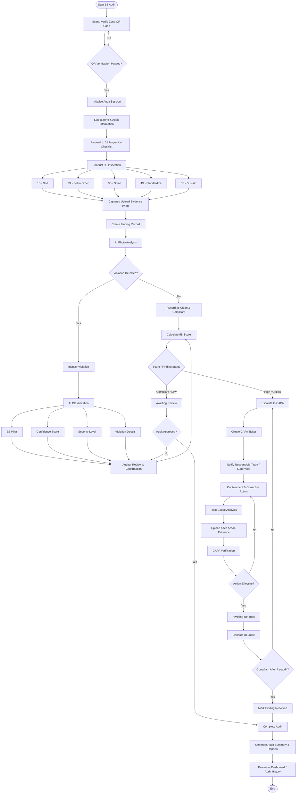

```mermaid
flowchart TD
    A([Start 5S Audit]) --> B[Scan / Verify Zone QR Code]
    B --> C{QR Verification Passed?}

    C -- No --> B
    C -- Yes --> D[Initialize Audit Session]
    
    D --> E[Select Zone & Audit Information]
    E --> F[Proceed to 5S Inspection Checklist]

    F --> G[Conduct 5S Inspection]
    
    G --> G1[1S - Sort]
    G --> G2[2S - Set in Order]
    G --> G3[3S - Shine]
    G --> G4[4S - Standardize]
    G --> G5[5S - Sustain]

    G1 --> H[Capture / Upload Evidence Photo]
    G2 --> H
    G3 --> H
    G4 --> H
    G5 --> H

    H --> I[Create Finding Record]
    I --> J[AI Photo Analysis]

    J --> K{Violation Detected?}

    K -- No --> L[Record as Clean & Compliant]
    K -- Yes --> M[Identify Violation]
    
    M --> N[AI Classification]
    N --> N1[5S Pillar]
    N --> N2[Confidence Score]
    N --> N3[Severity Level]
    N --> N4[Violation Details]

    N1 --> O[Auditor Review & Confirmation]
    N2 --> O
    N3 --> O
    N4 --> O

    L --> P[Calculate 5S Score]
    O --> P

    P --> Q{Score / Finding Status}

    Q -- Compliant / Low --> R[Awaiting Review]
    Q -- High / Critical --> S[Escalate to CAPA]

    S --> T[Create CAPA Ticket]
    T --> U[Notify Responsible Team / Supervisor]
    U --> V[Containment & Corrective Action]
    V --> W[Root Cause Analysis]
    W --> X[Upload After-Action Evidence]
    X --> Y[CAPA Verification]

    Y --> Z{Action Effective?}

    Z -- No --> V
    Z -- Yes --> AA[Awaiting Re-audit]

    AA --> AB[Conduct Re-audit]
    AB --> AC{Compliant After Re-audit?}

    AC -- No --> S
    AC -- Yes --> AD[Mark Finding Resolved]

    R --> AE{Audit Approved?}
    AE -- No --> O
    AE -- Yes --> AF[Complete Audit]

    AD --> AF
    AF --> AG[Generate Audit Summary & Reports]
    AG --> AH[Executive Dashboard / Audit History]
    AH --> AI([End])

```
